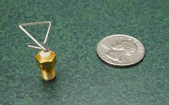

# Intro to genetic algorithms with python
check the medium article [here](https://medium.com/@amineziadus/intro-to-genetic-algorithms-with-python-d998fba619e0)

Genetic algorithms (GA) are optimisation , search and learning algorithms famous for their ability to solve problems with large number parameters and complex mathematical representations and they are sometimes used to tune models parameters in machine learning .

there were inspired from the Charles Darwin evolution theory 

NASA used them to create optimised antennas for their spacecrafts . find more details [here](https://ti.arc.nasa.gov/m/pub-archive/1244h/1244%20(Hornby).pdf)



# the OneMax problem

 we will try to solve the one max problem which consists of trying to find a binary string of a given length here 5 that sums to the maximum number 

- 10010 (sum of digits = 2)
- 01110 (sum of digits = 3)
- 11111 (sum of digits = 5)

we all know that the solution to this problem is the 11111 string but we will see how a genetic algoritm can find it 

# the initial population

The initial population is a set of valid candidates  (**individuals**) with a specified **population size** chosen randomly . which are called **chromosomes** , therefore the population is actually a set of chromosomes. which should conform to a format that we chose for the problem at hand, for example, binary strings of length 5 . and each string bit is called a **gene** 

```python
import numpy as np
def generate(pop_size=6,individual_len=5):
  population = np.random.choice([0, 1], size=pop_size*individual_len)
  return population.reshape([pop_size,individual_len])
generate()
>>> array([[1, 1, 0, 1, 1],
       [0, 0, 0, 0, 0],
       [0, 1, 0, 0, 0],
       [0, 1, 1, 0, 1],
       [0, 0, 1, 0, 1],
       [1, 0, 0, 0, 1]])
```


# the fitness function

the fitness function is a function that we use to calculate the **fitness score** (efficiency) of each individual .  like here the function is the sum of the string bits

```python
def fitness(population):
    scores = []
    for pop in population:
      score,i = 0,0
      while i < len(pop):
        score += pop[i]
        i += 1
      scores.append(score)
    return np.array(scores)
fitness(generate())
>>> array([4, 1, 0, 2, 4, 2])
```

# natural selection

here we will select the best individuals (parents) to participate in the **crossover** and create a new population (new **generation**) in order to genrate better solutions also the losers individuals in the selection dies.

## Tournament selection

for simplicity we will use this type of selection which consists of selecting two or more (**tournament size**) individuals  randomly from the population  , and the one with the highest fitness score wins and gets selected to be mated 

```python
def Tournament_selection(pop,prnt=3,indiv_selec=2):
    scores = fitness(pop)
    index = []
    # create random parent indexes
    random = np.random.randint(len(pop[0]),size=(prnt,indiv_selec))
    for i in range(random.shape[0]):
      # select the best element in the i th tournament and return its index
      inx = np.argmax([scores[random[i][j]] for j in range(len(list(random[i])))])
      index.append(random[i][inx])
    return index
Tournament_selection(generate())
>>> [4, 1, 3]
# this means that the elements with these indexes should pass the crossover
```

# crossover

The crossover operator or recombination, corresponds to the crossover that takes place during reproduction in biology, and is used to combine the genetic
information of two individuals, serving as parents, to produce (usually two) offsprings (kids) that are added to the new population with their parents .

## k-point crossover

In the k-point crossover method, k-crossover points on the chromosomes of both parents are selected randomly. The genes residing between these points are swapped between the two parent chromosomes.

the following diagram demonstrates a two-point crossover 
chromosomes, with the first crossover point located between the third and fourth gene and the other between the seventh and eighth genes:


[source](https://commons.wikimedia.org/wiki/File:Computational.science.Genetic.algorithm.Crossover.Two.Point.svg) 

```python
from itertools import permutations
def crossover(pop,offsprings=3):
    mates = list(permutations(Tournament_selection(pop),2))[:offsprings]
    population = []
    for i in mates:
      offspring1 = [pop[i[0]][:2][0] , pop[i[0]][:2][1], pop[i[1]][2:3][0],pop[i[0]][3:][0],pop[i[0]][3:][1]]
      offspring2 = [pop[i[1]][:2][0] , pop[i[1]][:2][1], pop[i[0]][2:3][0],pop[i[1]][3:][0],pop[i[1]][3:][1]]
      population.append(offspring1)
      population.append(offspring2)
    return np.array(population)
crossover(generate())
>>> array([[0, 1, 1, 1, 0],
       [1, 1, 0, 0, 0],
       [0, 1, 0, 1, 0],
       [1, 0, 0, 1, 1],
       [1, 1, 0, 0, 0],
       [0, 1, 1, 1, 0]])
```

# mutation

The mutation operator is applied to the offspring that were created as a result
of the selection and crossover operations. with a low probability of occurence in order to not transfrom it to a random search and mantain the diversity

## bit flip mutation

we will use it to transform one of our offsprings genes to a 1 if it was a 0 and viceversa . with a low probabilty of occurence

```python
def mutation(pop,mutation_num=1):
  pop = crossover(pop)
  index = np.random.randint(4,size=2)
  if pop[index[0]][index[1]] == 0:
    pop[index[0]][index[1]] = 1
  else:
    pop[index[0]][index[1]] = 0
  return pop
crossover(generate())
>>> array([[0, 0, 1, 1, 1],
       [0, 0, 0, 1, 0],
       [0, 0, 1, 1, 1],
       [1, 0, 0, 1, 1],
       [0, 0, 0, 1, 0],
       [0, 0, 1, 1, 1]])
```


after finishing these steps we repeat this process of natural selection to create new generation until we reach the best solution or we reach a specified number of generations 

Et voilà , our genetic algorithms found the best solution in 4 generation 

In machine learning hyper parameters tuning we usually don't have  binary bits so we slightly change our algorithm to solve this kind of problems 

```python
#run loop
pop = generate()
i = 0
while max(fitness(pop)) != 5:
  pop = mutation(pop)
  print(f"generation {i} : {max(fitness(pop))}")
  i += 1
>>> generation 0 : 3
generation 1 : 4
generation 2 : 4
generation 3 : 5
```

# 📍Notes

if you want to learn more about these algorithms. I recommend reading this book : [Hands-On Genetic Algorithms with Python](https://www.packtpub.com/product/hands-on-genetic-algorithms-with-python/9781838557744)